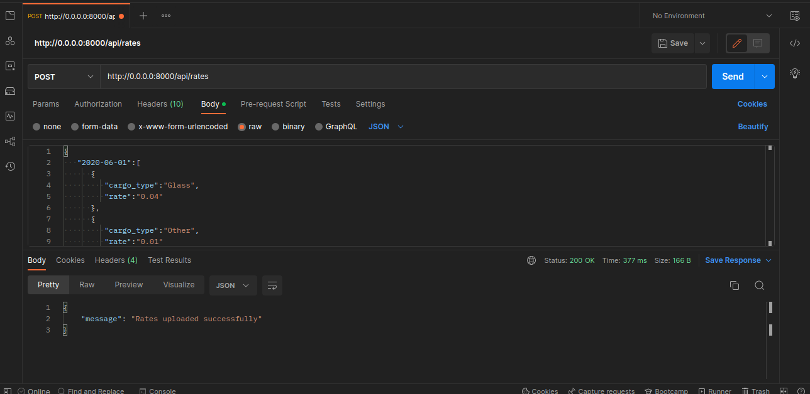
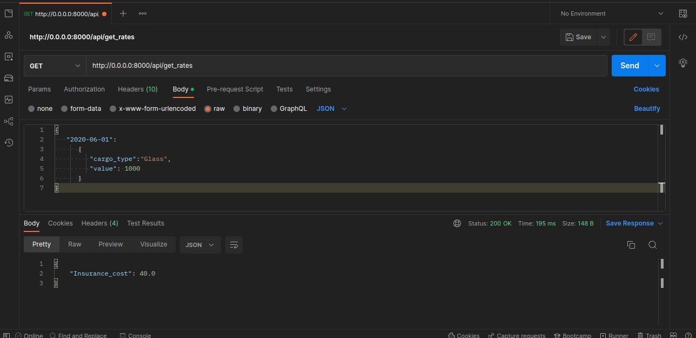
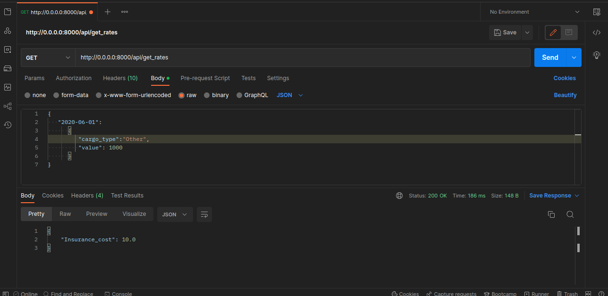

<h1>Cargo Insurance instruction

<h2>Установка и запуск приложения</h2>
<section><ul>
<li>Клонируйте репозиторий <code>git clone https://github.com/CHRNVpy/cargo_rates.git</code></li>
<li>Перейдите в директорию репозитория <code>cd cargo_rates</code></li>
<li>Создайте Docker контейнер <code>docker-compose up</code></li>
</ul>
</section>

<section>
<ul>После сборки контейнера сервер FastAPI запустится автоматически. 
    

<h2>API ENDPOINTS</h2>

BASE URL: <code>https://0.0.0.0:8000</code>

<section>
  <h3>Добавление тарифов</h3>
  
<strong>ENDPOINT:</strong> <code><strong>POST</strong> /api/rates/</code>

  
<strong>Headers:</strong>

  <ul>
    <li><code>Content-Type:</code> application/json</li>
  </ul>
  
Example Request Body:

  
</section>
<section>
  <h3>Получение cтоимости страхования</h3>
  
<strong>ENDPOINT:</strong> <code><strong>GET</strong> /api/get_rates/</code>

  
<strong>Headers:</strong>

  <ul>
    <li><code>Content-Type:</code> application/json</li>
  </ul>
  
Example Response:

  
  
</section>
